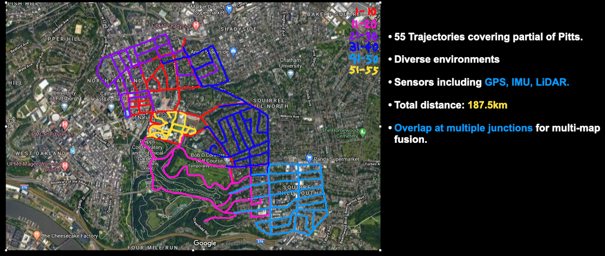
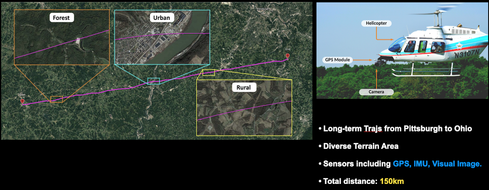

# GPR Competition datasets

Dataset for the General Place Recognition Competition. You can find more details in the competition website: [http://gprcompetition.com/](http://gprcompetition.com/)

## Note
- **1st-round Competition: <font color=Red>04/08/2022~05/24/2022</font>**
  * :1st_place_medal:1st and :2nd_place_medal:2nd --> Present @ ICRA 2022

- **2nd-round Competition: <font color=Red>06/01/2022~09/01/2022</font>**
  * :1st_place_medal:1st --> :dollar: 3000$
  * :2nd_place_medal:2nd --> :dollar: 2000$
  * Exceptional Individuals 
    * Academic Visits to [RI](https://www.ri.cmu.edu/)
    * Internship at [Air Lab](http://theairlab.org/)

- **Large-scale 3D Localization Dataset:**
  * **Training and validation set release: <font color=Red>8th May</font>**
  * **Testing set release: <font color=Red>9th May</font>**

- **Visual Terrain Relative Navigation Datase:**
  * **Training and validation set release: <font color=Red>9th May</font>**
  * **Testing set release: <font color=Red>9th May</font>**

## AIcrowd
The performance is evaluated on AIcrowd, please sign up or log in [here](https://www.aicrowd.com/) and register the competition

* [[ICRA2022] General Place Recognition: City-scale UGV Localization](https://www.aicrowd.com/challenges/icra2022-general-place-recognition-city-scale-ugv-localization)

* [[ICRA2022] General Place Recognition: Visual Terrain Relative Navigation](https://www.aicrowd.com/challenges/icra2022-general-place-recognition-visual-terrain-relative-navigation)

## Datasets

We provide two datasets for evaluating place recognition or global localization methods. They are

- **Large-scale 3D Localization Dataset**: This competition dataset is a subset of the [ALITA](https://github.com/MetaSLAM/ALITA) dataset, which can be accessed [here](https://github.com/MetaSLAM/ALITA).
This dataset aims for the Large-scale 3D Localization (LiDAR$\rightarrow$LiDAR) competition track. It has LiDAR point clouds and ground truth poses for 55 trajectories, collected in Pittsburgh. Each trajectory is divided into several submaps: 
  * In ROUND 1, a submap has size 50m*50m with the distance between every two submaps being 2m. [Dropbox](https://www.dropbox.com/sh/q1w5dmghbkut553/AAAOCMaELmfHE4NN5cw06QBba?dl=0) or [百度云盘](https://pan.baidu.com/s/1M97bBnSoRhy-56NhAmpf7w)(提取码:qghd); 
  * In ROUND 2, a submap has size 40m*40m with the distance between every two submaps being 2m. [Dropbox](https://www.dropbox.com/sh/mgqypozwz1l8z9x/AABshUNN5lu8sWGVE5CtEhjoa?dl=0) or [百度云盘](https://pan.baidu.com/s/1M97bBnSoRhy-56NhAmpf7w)(提取码:qghd).
    
  

  In this dataset, we include:
  * Point cloud submaps (size 50m*50m, every 2m along the trajectory).
  * Ground truth poses of submaps (6DoF)

  You can find the **sample** training data `gpr_pitts_sample.tar.gz` and testing/query data `gpr_pitts_query_sample.tar.gz` [here](https://sandbox.zenodo.org/record/1033096).

- **Visual Terrain Relative Navigation Dataset**: This competition dataset is a subset of the [ALTO](https://github.com/MetaSLAM/ALTO) dataset, which can be accessed [here](https://github.com/MetaSLAM/ALTO). 
This dataset focuses on visual place recognition over a large-scale trajectory. The trajectory of interest is a 150km long flight from Ohio to Pittsburgh using a helicopter with a nadir-facing high resolution camera. The trajectory includes several types of environments of varying difficulty, including urban/suburban, forested, rural, and other natural terrain.
Part of the difficulty of this challenge involves being able to correctly match the inference imagery to the reference map imagery taken several years prior. We captured this flight in August 2017, and we include georeferenced satellite imagery from 2012.
Ground truth positions of the flight were collected using a NovAtel's SPAN GPS+INS, with submeter level accuracy. 

* The ROUND 1 dataset is available here: [Dropbox](https://www.dropbox.com/sh/q1w5dmghbkut553/AAAOCMaELmfHE4NN5cw06QBba?dl=0) or [百度云盘](https://pan.baidu.com/s/1M97bBnSoRhy-56NhAmpf7w)(提取码:qghd).

* The ROUND 2 dataset is available here: [Dropbox](https://www.dropbox.com/scl/fo/saejbf9qanbfq40k8jo18/h?dl=0&rlkey=l19kx1vzzahifv3n5lkg19n84) or [百度云盘](https://pan.baidu.com/s/1M97bBnSoRhy-56NhAmpf7w)(提取码:qghd).
    
    

    In this dataset, we include:
    * High resolution (compressed to 500x500) helicopter imagery, captured at 20fps. Timestamps are synchronized with the rest of the system.
    * Paired reference satellite image for each helicopter frame.
    * IMU (scalar last quaternion, in ECEF reference frame)
    * Global positions (UTM coordinates).

Relative ground truth for each sequence compared with the corresponding selected reference sequence is provided.

Datasets are *pre-processed* and you can easily manage the data with our tools. For more information about dataset, please refer to [dataset description](./docs/dataset_description.md).

## Install

The easiest way to install our tools is by using pip. We recommend the use of virtual environment such as `conda` to keep a clean software environment.

```bash
~$ git clone https://github.com/MetaSLAM/GPR_Competition.git
~$ conda create --name GPR python=3.7
~$ conda activate GPR
(GPR) ~$ cd GPR_Competition
(GPR) ~/GPR_Competition$ pip install -r requirements.txt
(GPR) ~/GPR_Competition$ python setup.py install
```

## Modules

Our package organizes different functions in sub-modules. You may have a better understanding of the `gpr` package with this table:

module | description
:--:   |--
`gpr`|common definations
`gpr.dataloader`|load dataset from disk, get images, point clouds, poses, etc.
`gpr.evaluation`|evaluate your method, such as recall@N, accuracy, PR curve
`gpr.tools`|utility, such as feature extraction, point cloud projection

## Quick Start

To quickly use this package for your place recognition task, we provide the test templates (both python scripts and jupyter notebooks) within the folder `tests/`. For **Pittsburgh City-scale Dataset** datasets, we can start a quick evaluation.

First, download the sample data [here](https://sandbox.zenodo.org/record/1033096). Decompress `gpr_pitts_sample.tar.gz` to **PATH_TO_DATA**. Then you can test it with the following code:

```python
import numpy as np
from gpr.dataloader import PittsLoader
from gpr.evaluation import get_recall
from gpr.tools import HogFeature, lidar_trans

# * Test Data Loader, change to your datafolder
pitts_loader = PittsLoader('PATH_TO_DATA')

# * Point cloud conversion and feature extractor
lidar_to_sph = lidar_trans()  # for lidar projections
hog_fea = HogFeature()

# feature extraction
feature_ref = []
for idx in tqdm(range(len(pitts_loader)), desc='comp. fea.'):
    pcd_ref = pitts_loader[idx]['pcd']

    # You can use your own method to extract feature
    sph_img = lidar_to_sph.sph_projection(pcd_ref)
    sph_img = (sph_img * 255).astype(np.uint8)
    feature_ref.append(hog_fea.infer_data(sph_img))

# evaluate recall
feature_ref = np.array(feature_ref)
topN_recall, one_percent_recall = get_recall(feature_ref, feature_ref)
```

Second, if you want to evaluate your model on validation set, please refer to our example code [here](tests/val_pitts.py)

Then, if you want to submit your result, use the following code to save the (num_submap * feature_dim) feature to a *.npy file:
```python
from gpr.tools import save_feature_for_submission
save_feature_for_submission('FILE_NAME.npy', feature_ref)
```
and you can submit the `FILE_NAME.npy` to the AIcrowd platform.

For more about the data loader, visualization and evaluation, please refer to [loading_data.md](./docs/loading_data.md) and the jupyter notebook [test_pitts.ipynb](./tests/test_pitts.ipynb).
