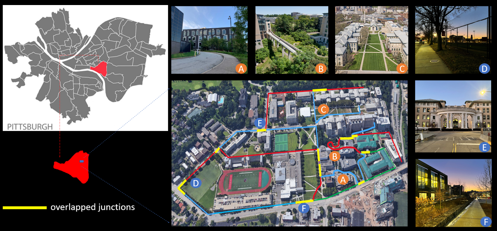

# GPR Competition datasets

Dataset for the General Place Recognition Competition. You can find more details in the competition website: [http://gprcompetition.com/](http://gprcompetition.com/)

## Datasets

We provide two datasets for evaluating place recognition or global localization methods. They are

- **CMU Cross-Domain Dataset**: This dataset aims for the Large-scale 3D Localization (LiDAR→LiDAR) competition track. It has LiDAR point clouds and ground truth poses for 55 trajectories, collected in Pittsburgh. Each trajectory is divided into several submaps, and a submap has size 50m*50m with the distance between every two submaps being 2m. [Download](https://xxxx).  
    

This dataset focuses on visual localization for UGVs using omnidirectional cameras within outdoor campus-type environments. We collected 80 real-world UAV sequences using a rover robot equipped with a 360 camera, a Velodyne VLP-16 LiDAR, a RealSense VIO and an Xsens MTI IMU. These consisted of 10 different trajectories. For each trajectory, we traversed 8 times, including forward(start point to endpoint)/backward(endpoint to start point) directions and day-light (2pm to 4:30pm)/dawn-light (6am to 7am or 5pm to 6pm). 8-times includes two forward sequences and two backward sequences during day-light and two forward and two backward sequences during dawn-light.Each trajectory is at least overlapped at one junction with the others,and some trajectories even have multiple junctions. This feature enables the dataset to be used in tasks such as LiDAR place recognition and multi-map fusion.

The original dataset contains point clouds and IMU data. For each trajectory, one sequence is being selected as the reference sequence.Its poses are generated by SLAM and later optimized by Interactive SLAM.We then used Interactive SLAM to generate the relative positions of the other sequences compared to the reference sequence.These data can be used as relative ground truth data.

In this dataset, we include:

* High resolution (1024x512) omnidirectional imagery, captured at 15fps. Timestamps are synchronized with the rest of the system.
* Timestamped IMU (linear accelerations and angular velocities)
* Timestamped VLP-16 LiDAR generated point cloud data
* Timestamped RealSense generated odometry data

Relative ground truth for each sequence compared with the corresponding selected reference sequence.

Datasets are pre-processed and you can easily manage the data with our tools. For more information about dataset, please refer to [dataset description](./docs/dataset_description.md).

## Install

The easiest way to install our tools is by using pip. We recommend the use of virtual environment such as `conda` to keep a clean software environment.

```bash
~$ git clone https://github.com/MetaSLAM/GPR_Competition.git
~$ conda create --name GPR python=3.7
~$ source activate GPR
(GPR) ~$ cd GPR_Competition
(GPR) ~/GPR_Competition$ pip install -r requirements.txt
(GPR) ~/GPR_Competition$ python setup.py install
```

## Modules

Our package organizes different functions in sub-modules. You may have a better understanding of the `gpr` package with this table:

module | description
:--:   |--
`gpr`|common definations
`gpr.dataloader`|load dataset from disk, get images, point clouds, poses, etc.
`gpr.evaluation`|evaluate your method, such as recall@N, accuracy, PR curve
`gpr.tools`|utility, such as rotation, translation, transformation

## Quick Start

To quickly use this package for your place recognition task, we provide the test template within the folder `tests`. For **CMU-CrossDomain** datasets, we can quickly evaluate by,

```python
from gpr.dataloader import lifeloader
from gpr.evaluation import get_recall
from gpr.tools import Feature, to_image

#* Test Data Loader
loader1 = lifeloader('/PATH_TO_DATA_TRAJ1')
loader2 = lifeloader('/PATH_TO_DATA_TRAJ2')
F = Feature() # Default Opencv HoG Feature

feature_ref = []
feature_test = []
for idx in range(100):
    data1 = loader1.__getitem__(10) #{'img': img, 'pcd': pcd, 'sph': sph, 'top': top}
    data2 = loader2.__getitem__(10) #{'img': img, 'pcd': pcd, 'sph': sph, 'top': top}

    #* Feature Extraction and Evaluation
    feature_ref.append(F.infer_data(to_image(data1['img'])))
    feature_test.append(F.infer_data(to_image(data2['img'])))

feature_ref = np.array(feature_ref)
feature_test = np.array(feature_test)

topN_recall, one_percent_recall = get_recall(feature_ref, feature_test)
```

For more about the data loader, please refer to [loading_data.md](./docs/loading_data.md).
