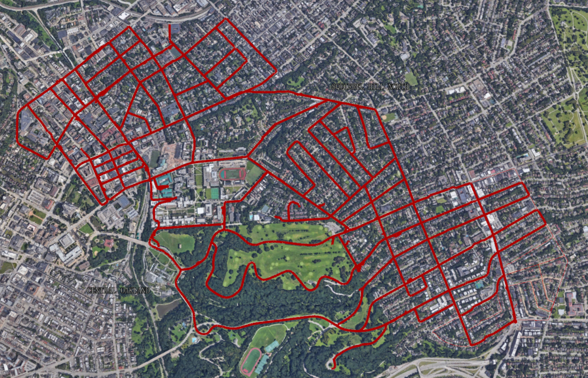

# Dataset Description

## Pittsburgh City-scale Dataset

Pittsburgh city-scale dataset consists abundant sensory information including GPS, IMU and LiDAR. We created it by traversing 187.5 km in the city of Pittsburgh, which results in over 70 thousand dense LiDAR submaps.

    
     
    
Map of the route used for dataset collection

* Driving distance: 187.5 km, total tracks number: 55
* Overlap at multiple junctions for multi-map fusion
