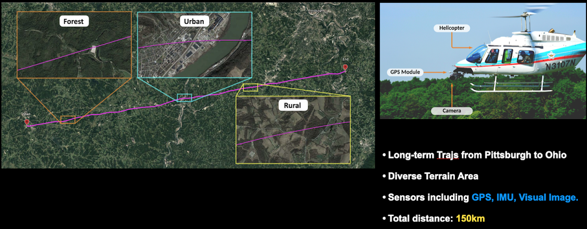

# Dataset Description

## City-scale UGV Localization Dataset

Pittsburgh city-scale dataset consists abundant sensory information including GPS, IMU and LiDAR. We created it by traversing 187.5 km in the city of Pittsburgh, which results in over 70 thousand dense LiDAR submaps.

    
     
    Map of the route used for dataset collection
     
    
     
    A total number of 55 trajectories

* Driving distance: 187.5 km, total tracks number: 55
* Overlap at multiple junctions for multi-map fusion

This dataset concentrates on the LiDAR place recognition over a large-scale area within urban environment. We collected 55 vehicle trajectories covering partial of the Pittsburgh and thus including diverse enviroments. Each trajectory is at least overlapped at one junction with the others, and some trajectories even have multiple junctions. This feature enables the dataset to be used in tasks such as LiDAR place recognition and multi-map fusion.

The original dataset contains point clouds and GPS data. We generate ground truth poses by SLAM, which is fused with the GPS data and later optimized by Interactive SLAM. With this process, we also get the map of each trajectory. For convenience, we slice the map along the trajectory into several submaps, and a submap has size 50m*50m with the distance between every two submaps being 2m. The global 6DoF ground truth pose of each submap is also given, so that you can easily determine the distance relation of submaps.

In this dataset, we include:
- Point cloud submaps (size 50m*50m, every 2m along the trajectory).
- Ground truth poses of submaps (6DoF)

## Visual Terrain Relative Navigation

This dataset focuses on visual place recognition over a large-scale trajectory. The trajectory of interest is a 150km long flight from Ohio to Pittsburgh using a helicopter with a nadir-facing high resolution camera. The trajectory includes several types of environments of varying difficulty, including urban/suburban, forested, rural, and other natural terrain.

    
     
    A long trajectory including various environments

Part of the difficulty of this challenge involves being able to correctly match the inference imagery to the reference map imagery taken several years prior. We captured this flight in August 2017, and we include georeferenced satellite imagery from 2012.

Ground truth positions of the flight were collected using a NovAtel's SPAN GPS+INS, with submeter level accuracy.

In this dataset, we include:
- High resolution (1600x1200) helicopter imagery, captured at 20fps. Timestamps are synchronized with the rest of the system.
- Paired reference satellite image for each helicopter frame.
- Timestamped IMU (linear and angular velocities)
- Timestamped global positions (ECEF coordinates).
